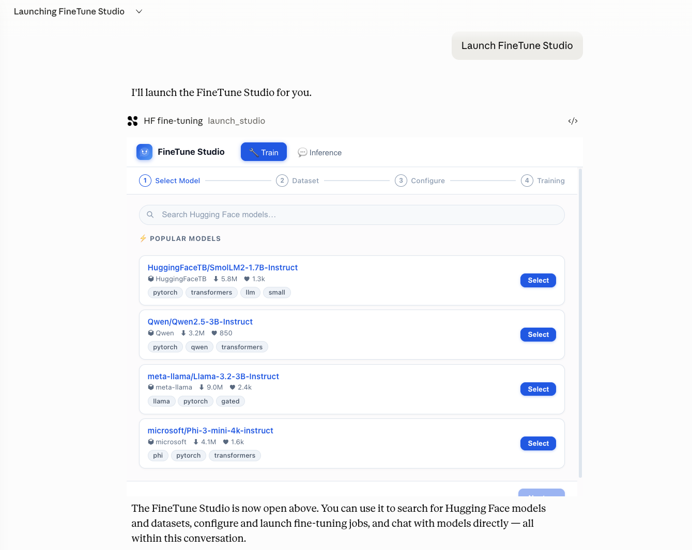
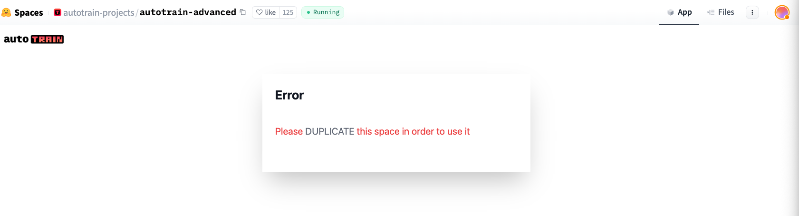
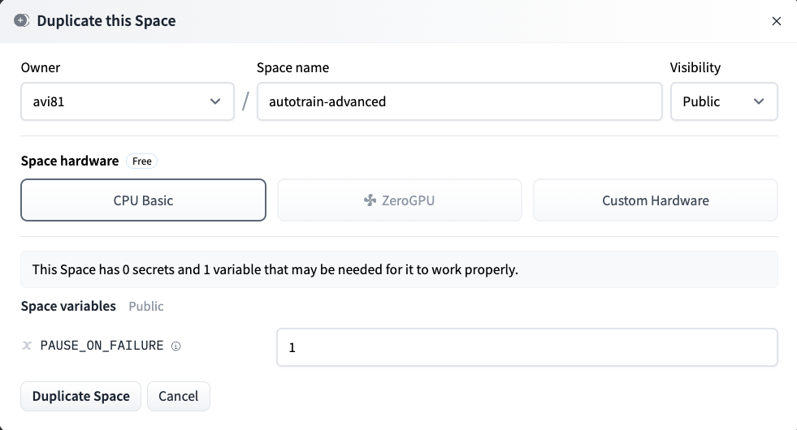
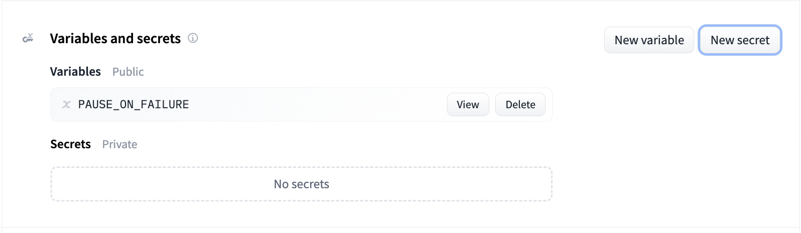
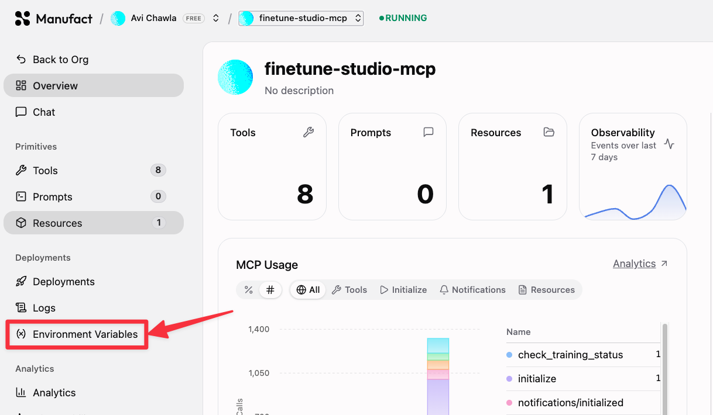
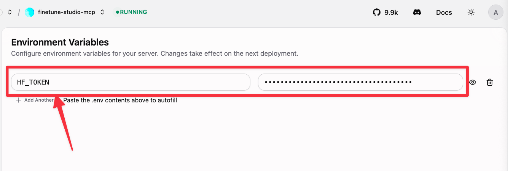
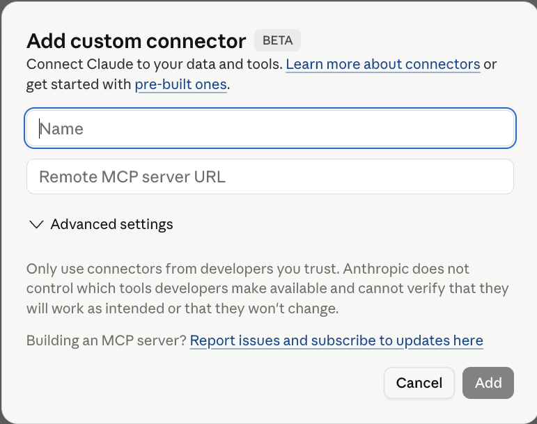

# FineTune Studio

FineTune Studio is an MCP (Model Context Protocol) app that lets you fine-tune any language model on Hugging Face, directly inside Claude, without writing a single line of code. You pick a model, pick a dataset, configure your hyperparameters, launch training, and chat with your fine-tuned model, all from one interface embedded in Claude.



Under the hood it uses Hugging Face AutoTrain Advanced for the actual GPU training and automatically spins up a private Gradio inference Space when training finishes.

The app runs on [Manufact](https://manufact.com) (Manufact MCP Cloud), the platform for deploying MCP servers and apps to production with observability, logs, metrics, and GitHub integration built in.

---

## Overview of the Full Flow

```
Clone repo
    |
    v
Create HF account and get a write token
    |
    v
Load HF credits (GPU time costs money)
    |
    v
Duplicate the AutoTrain Space into your HF account
    |
    v
Deploy to Manufact (CLI or GitHub auto-deploy)
    |
    v
Set HF_TOKEN on Manufact dashboard
    |
    v
Open Claude, open FineTune Studio, start training
    |
    v
Chat with your fine-tuned model
```

---

## Part 1: Get the Code

### Clone the repository

```bash
git clone https://github.com/your-username/finetune-studio-mcp.git
cd finetune-studio-mcp
```

Install dependencies:

```bash
npm install
```

---

## Part 2: Set Up Hugging Face

You need a Hugging Face account, a write token, and enough credits to pay for GPU time.

### Step 1: Create a Hugging Face account

Go to [huggingface.co](https://huggingface.co) and sign up. Your username is important because all your models and Spaces will live under it, for example `yourname/my-fine-tuned-model`.

### Step 2: Load credits

Fine-tuning runs on GPU hardware that Hugging Face bills by the hour. You need credits loaded before you can launch a training job.

1. Go to [huggingface.co/settings/billing](https://huggingface.co/settings/billing)
2. Under **Credits**, click **Buy credits** and purchase at least $5 to start
3. Credits are consumed only while a training job is actively running

Rough cost per training run:

| Hardware | Cost per hour | Typical run (1B model, 3 epochs) |
|---|---|---|
| T4 16GB (budget) | ~$0.40/hr | ~45 min (~$0.30) |
| A10G 24GB small | ~$0.75/hr | ~20 min (~$0.25) |
| A10G 24GB (default) | ~$1.50/hr | ~15 min (~$0.38) |
| A100 80GB (large models) | ~$4.00/hr | ~10 min (~$0.67) |

### Step 3: Create a Hugging Face token

1. Go to [huggingface.co/settings/tokens](https://huggingface.co/settings/tokens)
2. Click **New token**
3. Give it a name like `finetune-studio`
4. Set the role to **Write** (the app creates Spaces and pushes models on your behalf)
5. Click **Generate token**
6. Copy the token, it starts with `hf_`

Keep this token private. Anyone with it can read and write to your HF account.

### Step 4: Set up AutoTrain Advanced

FineTune Studio uses Hugging Face AutoTrain Advanced to run the GPU training. AutoTrain needs to live in your own HF account so costs go to you directly.

**Duplicate the Space:**

1. Go to [huggingface.co/spaces/autotrain-projects/autotrain-advanced](https://huggingface.co/spaces/autotrain-projects/autotrain-advanced)
2. Click the three-dot menu at the top right of the Space card and choose **Duplicate this Space** or press Duplicate if visible on the screen:



3. Set the owner to your username
4. Keep the name as `autotrain-advanced`
5. Set visibility to **Private** (important: this Space will hold your token)
6. Select Hardware: CPU Basic



7. Click **Duplicate Space**

**Add your token as a Space secret:**


1. Open your Space at `huggingface.co/spaces/yourname/autotrain-advanced`
2. Go to **Settings** (top right)
3. Scroll to **Repository secrets**
4. Click **New secret**
5. Name: `HF_TOKEN`
6. Value: paste your token from Step 3
7. Click **Save**

The Space restarts and applies the secret. You only need to do this once.

---

## Part 3: Deploy to Manufact

[Manufact](https://manufact.com) is the MCP Cloud platform that hosts our app that runs in Claude Desktop. It gives you production deployment, preview URLs per branch, live logs, tool-call metrics, and JSON-RPC traces, all without writing any Docker or YAML config.

There are two ways to deploy: the CLI (quickest for a first deploy) or GitHub integration (best for ongoing development with auto-deploys on every push).

---

### Option A: Deploy with the CLI

This is the fastest way to get running.

**Install the CLI:**

```bash
npm install -g @mcp-use/cli
```

**Log in to Manufact:**

```bash
npx @mcp-use/cli login
```

This opens your browser and takes you through the Manufact auth flow. Once authenticated, the CLI saves a session token locally.

**Build and deploy:**

```bash
npm run build
npx @mcp-use/cli deploy
```

The CLI packages your server, uploads it to Manufact Cloud, and prints the live URL when done. You will see something like:

```
Deployed to https://your-server-name.manufact.app/mcp
```

**Set your HF token on the dashboard:**

After deploying, go to your server on [manufact.com](https://manufact.com), open **Settings**, find **Environment Variables**:



Next, set the HF_TOKEN environment variable:



```
HF_TOKEN = hf_xxxxxxxxxxxxxxxxxxxx
```

Save and the server restarts with the token available.

---

### Option B: GitHub Auto-Deploy (Recommended for ongoing development)

With this approach, every push to your main branch automatically redeploys your server on Manufact. Pull requests get their own preview URL.

**Step 1: Push your code to GitHub**

```bash
git remote add origin https://github.com/your-username/finetune-studio-mcp.git
git push -u origin main
```

**Step 2: Connect your repo on Manufact**

1. Go to [manufact.com](https://manufact.com) and sign in
2. Click **New Server**
3. Choose **Import from GitHub** and authorize the Manufact GitHub App
4. Select your `finetune-studio-mcp` repository

Manufact clones your repo, builds it, and deploys it. From this point on, every push to `main` triggers a new deployment automatically.

**Step 3: Add your HF token**

In your server on [manufact.com](https://manufact.com):

1. Open **Settings** then **Environment Variables**
2. Add a new variable:
   - Key: `HF_TOKEN`
   - Value: your `hf_xxxxxxxxxxxxxxxxxxxx` token
3. Click **Save**

The server redeploys with the token set.

---

## Part 4: Connect to Claude

Once your server is live on Manufact, you need to tell Claude about it.

1. Open [claude.ai](https://claude.ai) and go to **Settings** then **Connectors** (or the MCP section in your workspace)
2. Add a new MCP server
3. Paste your Manufact server URL, for example `https://your-server-name.manufact.app/mcp`
4. Save



The next time you open a conversation in Claude, FineTune Studio appears as a tool and the widget loads in the side panel.

---

## Part 5: Use FineTune Studio

Start a new chat in Claude code and write and type "start fine-tuning studio" in the prompt. This will automatically open the Finetuning Studio.

Once the widget is open in Claude you will see a four-step wizard:

```
[1] Select Model  ->  [2] Dataset  ->  [3] Configure  ->  [4] Training
```

Each step gets a checkmark once it is complete.

### Step 1: Select a Model

The app shows a grid of popular small models that work well with LoRA fine-tuning:

- SmolLM2 (135M, 360M, 1.7B)
- Qwen 2.5 (0.5B, 1.5B)
- Gemma 3 1B
- Phi-4 mini

You can also search for any model on the Hub using the search box. A good starting point for experimentation is **SmolLM2-135M-Instruct** because it trains in under 15 minutes on an A10G.

Click a card to select a model, then click **Next**.

### Step 2: Pick a Dataset

**From the Hub:** Search for any public dataset by keyword. Popular fine-tuning datasets:

- `tatsu-lab/alpaca` for instruction following
- `HuggingFaceH4/ultrachat_200k` for conversation
- `timdettmers/openassistant-guanaco` for chat alignment

**Custom JSONL:** Switch to the **Custom data** tab and paste your own examples directly. Each line should be a valid JSON object. The most common format is one example per line with a `text` field:

```json
{"text": "### Instruction:\nSummarize this.\n\n### Response:\nHere is the summary."}
```

The app validates your data in real time and shows any formatting errors before you continue.

Click **Next**.

### Step 3: Configure Training

All settings have sensible defaults. You can click **Start Training** immediately or adjust anything here.

**Training type:**

| Type | When to use |
|---|---|
| SFT (Supervised Fine-Tuning) | Standard. Best for most cases: instruction following, domain adaptation, format learning |
| DPO (Direct Preference Optimization) | When you have preference pairs (chosen vs rejected responses) |
| ORPO (Odds Ratio Preference Optimization) | Alternative to DPO, often more stable |

**Chat template:**

| Setting | Use when |
|---|---|
| none | Your dataset already has a formatted `text` field (alpaca, guanaco, dolly style) |
| tokenizer | Your dataset has a `messages` column with `{role, content}` dicts |
| llama3 / chatml / alpaca / phi3 | You know the model uses a specific template format |

**Hyperparameters:**

| Setting | Default | What it controls |
|---|---|---|
| Epochs | 3 | Full passes through the dataset |
| Max Steps | 0 (full run) | Hard stop at N steps, useful for quick tests |
| Batch Size | 2 | Examples per GPU step |
| Learning Rate | 0.0002 | How fast the model adapts |
| Block Size | 1024 | Max token length per training example |
| Gradient Accumulation | 4 | Simulates a larger batch size without more memory |
| Warmup Ratio | 0.1 | Fraction of steps used for learning rate warmup |
| Weight Decay | 0.01 | Regularization to prevent overfitting |

**LoRA settings** (LoRA fine-tunes only a small set of added parameters instead of the full model):

| Setting | Default | What it controls |
|---|---|---|
| LoRA Rank (r) | 16 | Size of the low-rank matrices. Higher = more capacity |
| LoRA Alpha | 32 | Scaling factor, usually set to 2x the rank |
| LoRA Dropout | 0.05 | Regularization on LoRA layers |
| Quantization | none | int4 or int8 reduces memory at some quality cost |
| Target Modules | all-linear | Which layers get LoRA adapters |

**Hardware:**

| Option | GPU | Best for |
|---|---|---|
| A10G 24GB (recommended) | NVIDIA A10G | Models up to 7B |
| A10G 24GB small | NVIDIA A10G | Models up to 3B |
| T4 16GB (budget) | NVIDIA T4 | Small models, quick tests |
| A100 80GB | NVIDIA A100 | Large models 13B+ |

**Project name:** The name used for the training job and the published model. Your model lands at `huggingface.co/yourname/project-name`. The app generates a unique name automatically.

Click **Start Training**.

### Step 4: Watch Training

The app moves to the Training view and polls for status every 10 seconds. You see:

- A progress bar tracking epoch progress
- Live metrics: loss, learning rate, current epoch
- A scrolling log stream from the training container
- Elapsed time in the top right

When training finishes the wizard step 4 turns green with a checkmark.

### After Training

The success screen shows your model ID and confirms the inference Space was deployed:

```
Training complete!

Model ID: yourname/your-project-name
Inference Space deployed, building now (~2-3 min).  View Space ->

[View on Hub]  [Chat with model]  [Redeploy Space]
```

**View on Hub** opens your fine-tuned model page on Hugging Face.

**Chat with model** switches to the Inference tab with your model pre-selected. The inference Space needs 2 to 3 minutes to build its container and load the weights.

**Redeploy Space** pushes fresh inference app code to the Space. Use this if the Space is empty or not responding.

### The Inference Tab

The inference tab is a full chat interface. You can:

- Chat with your fine-tuned model once the Space is running
- Switch to any other public HF model by typing a model ID in the custom model input
- Adjust system prompt, temperature, and max tokens in the settings panel (gear icon, top right)
- Clear the conversation with the trash icon

---

## Troubleshooting

**"AutoTrain Space not found in your HF account"**

You need to duplicate the AutoTrain Space into your account before training. See Part 2 Step 4 of this guide. The app looks for a Space named `autotrain-advanced` under your username.

**"HF_TOKEN environment variable is not set"**

The server cannot find your token. Go to your project on [manufact.com](https://manufact.com), open Settings, add `HF_TOKEN` to environment variables, and redeploy.

**Training stuck at "Initializing" for more than 5 minutes**

AutoTrain is provisioning a GPU container. On first run this can take 3 to 5 minutes while the container image downloads. If it stays stuck past 10 minutes, check the training Space logs directly at `huggingface.co/spaces/yourname/autotrain-yourprojectname`.

**Inference Space shows "building" for a long time**

Large models (3B+) take 5 to 10 minutes to load after the container builds. You can watch the build progress at `huggingface.co/spaces/yourname/inference-yourprojectname`.

**"Redeploy Space" button**

If the inference Space is empty or the Gradio app is not responding, click **Redeploy Space** on the training complete screen. This re-commits the inference app code and triggers a fresh build.

**Model gives garbled or off-topic responses**

The most common cause is a mismatch between the chat template selected in Step 3 and the format of your training data. Double-check that you are using `none` for plain-text datasets and `tokenizer` (or a named template) for message-formatted datasets.

---

## Running Locally for Development

To run the server locally without deploying to Manufact:

```bash
# Install dependencies
npm install

# Build the frontend widget
npm run build

# Set your token and start the server (runs on port 3002)
HF_TOKEN=hf_yourtoken npm start
```

Point your MCP client at `http://localhost:3002/mcp`.

To watch for frontend changes during development:

```bash
npm run dev
```

---

## Project Structure

```
server.ts           MCP server. Defines all tools and serves the widget resource.
src/mcp-app.ts      Frontend widget (TypeScript, compiled to a single HTML file).
dist/widget.html    Compiled widget, served by the resource endpoint.
vite.config.ts      Vite build config (single-file output via vite-plugin-singlefile).
.github/workflows/  GitHub Actions workflow for automated Manufact deploys.
```

**MCP tools exposed by the server:**

| Tool | What it does |
|---|---|
| `launch_studio` | Opens the FineTune Studio widget in Claude |
| `search_models` | Searches the HF Hub for base models |
| `search_datasets` | Searches the HF Hub for datasets |
| `start_training` | Submits a training job to AutoTrain |
| `check_training_status` | Polls training progress and deploys the inference Space on completion |
| `deploy_inference_space` | Manually deploys or redeploys the Gradio inference Space |
| `chat_with_model` | Runs inference via the deployed Gradio Space |

---

## Tech Stack

| Layer | Technology |
|---|---|
| MCP server | TypeScript, `@modelcontextprotocol/sdk`, Express |
| Frontend widget | TypeScript, compiled to a single HTML file via Vite |
| Training backend | Hugging Face AutoTrain Advanced |
| Inference backend | Gradio Space with transformers pipeline |
| Deployment | Manufact MCP Cloud (manufact.com) |
| Build and CI | GitHub Actions + `@mcp-use/cli` |

---

## 📬 Stay Updated with Our Newsletter!

**Get a FREE Data Science eBook** 📖 with 150+ essential lessons in Data Science when you subscribe to our newsletter! Stay in the loop with the latest tutorials, insights, and exclusive resources. [Subscribe now!](https://join.dailydoseofds.com)

[](https://join.dailydoseofds.com)

## Contribution

Contributions are welcome! Feel free to fork this repository and submit pull requests with your improvements.

